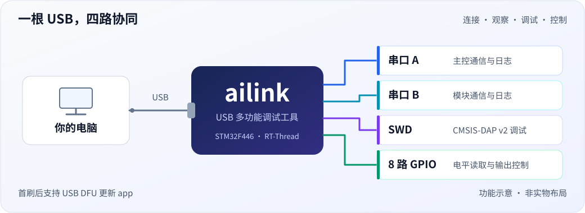
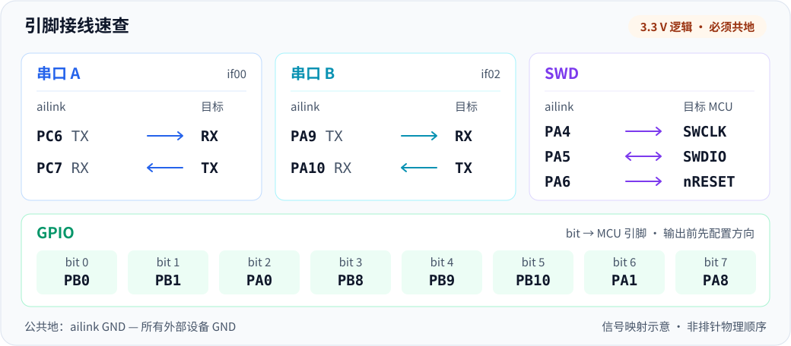
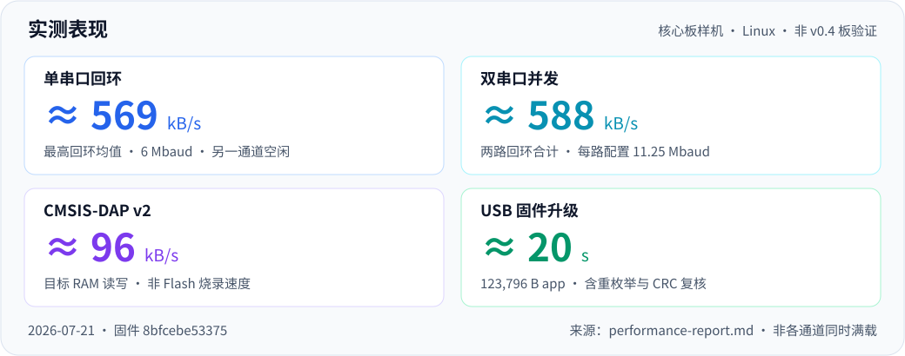

# ailink

  [](LICENSE)

**一根 USB 线，同时连接双路串口、SWD 调试与 8 路 GPIO。**

ailink 是基于 STM32F446 的开源 USB 多功能调试工具：同时监控两路 UART 流、调试目标 MCU，并用主机脚本控制 GPIO，减少桌面上的转接器与连线。



[快速开始](#快速开始) · [接线说明](#接线说明) · [使用示例](#使用示例) · [性能概览](#性能概览) · [开发与贡献](#开发与贡献)

## 能做什么

| 功能 | 使用体验 |
| --- | --- |
| 双路 USB 串口 | 两路独立 CDC ACM，波特率最高 **11.25 Mbaud**，同时连接两个串口设备 |
| CMSIS-DAP v2 | 接入 OpenOCD / pyOCD，支持 **SWD**，可与串口配合使用 |
| 8 路 GPIO | Python 工具配置方向、读取电平、按位控制输出 |
| USB 固件升级 | 首刷后通过 **USB DFU** 更新 app，无需再接外部调试器 |

> **使用前须知：** 本仓库提供固件与主机工具，需要自行准备匹配硬件。当前适配 **v0.4 产品板，新板尚未上板验证**；已有实测来自此前核心板样机。Linux 已验证，Windows 10+ 按自动绑驱设计但尚未实测，macOS 暂无验证记录。

## 快速开始

已有固件的设备只需 USB 数据线与 Linux 主机；空板先完成下文的[首次烧录](#开发与贡献)。以下以 Ubuntu / Debian 为例，在普通用户终端执行。

### 1. 安装主机工具

```bash
sudo apt install git python3 python3-venv libusb-1.0-0
git clone https://github.com/Huanfiy/ai-link.git
cd ai-link
python3 -m venv .venv
.venv/bin/python -m pip install -r tools/host/requirements.txt
```

后续命令均在仓库根目录执行，无需激活虚拟环境。

### 2. 配置权限

```bash
getent group plugdev || sudo groupadd plugdev
sudo usermod -aG plugdev "$USER"
sudo tools/host/install.sh
```

添加用户组后，**注销并重新登录，再插拔设备**。串口若提示权限不足，用 `ls -l /dev/ttyACM*` 检查所属组；若为 `dialout`，执行 `sudo usermod -aG dialout "$USER"` 后重新登录。

### 3. 确认识别成功

```bash
.venv/bin/python tools/host/ailink-ota.py info
ls -l /dev/serial/by-id/*ailink*
```

应显示固件版本与 CRC，以及两路串口：`if00` 为 **A 路**，`if02` 为 **B 路**。优先使用含设备 UID 的 `by-id` 路径，避免依赖易变化的 `ttyACM` 编号。

## 接线说明

> **3.3 V 逻辑电平，必须共地，串口 TX/RX 交叉连接。** 目标建议独立供电；使用板载供电前须核对电路，避免电源回灌。v0.4 供电与电流验证边界见[产品供电说明](docs/design/usb-bridge.md#产品供电与指示v04)。



SWD 仅支持 SWCLK / SWDIO / nRESET，**不支持 JTAG / SWO**。图中的 SWD 接口用于调试外部目标，不是给 ailink 自身首刷的接口；已有核心板请按新版引脚核对接线。

## 使用示例

各示例独立使用；先确认接线，再执行对应命令。

### 双路串口

将占位符替换为实际 `by-id` 路径，波特率与对端一致；另开终端选择 `if02` 即可使用 B 路，按 `Ctrl+]` 退出。

```bash
PORT='/dev/serial/by-id/替换为实际设备路径-if00'
.venv/bin/python -m serial.tools.miniterm "$PORT" 115200
```

需要压测时，断开该路外部设备并短接 TX/RX，再执行：

```bash
.venv/bin/python tools/host/bench.py "$PORT" 4000000 --window 2048
```

### SWD 调试

pyOCD 为可选依赖；以下命令识别探针，实际调试还需按目标 MCU 选择配置。

```bash
.venv/bin/python -m pip install pyocd
.venv/bin/pyocd list
```

### GPIO 控制

先用 `get` 读取状态。确认 **PB0 未连接其他输出源**后，下例只控制 bit 0，再恢复输入；掩码未选中的引脚保持不变。

```bash
.venv/bin/python tools/host/ailink-gpio.py get
.venv/bin/python tools/host/ailink-gpio.py dir 0x01 0x01
.venv/bin/python tools/host/ailink-gpio.py set 0x01 0x01
.venv/bin/python tools/host/ailink-gpio.py dir 0x01 0x00
```

### USB 固件升级

安装 `dfu-util >= 0.9`（`sudo apt install dfu-util`），准备匹配硬件的 app 镜像后执行：

```bash
.venv/bin/python tools/host/ailink-ota.py flash build/ailink.bin
```

工具自动校验镜像、进入 DFU、写入并核对 CRC。**升级期间所有业务通道离线**，请先结束串口和调试会话。boot 完好且 app 校验失败时可回落 DFU，重新执行升级；不覆盖 boot 损坏或硬件故障，详见[升级与恢复](docs/design/ota.md#恢复路径分层)。

## 性能概览



数据来自 **2026-07-21、固件 `8bfcebe53375`、核心板样机**，不是 v0.4 板验证结果。串口为回环吞吐，SWD 为目标 RAM 读写而非 Flash 烧录；环境与复现方法见[性能报告](performance-report.md)。

**使用边界：** 双串口与 DAP 共享 USB FS 带宽，波特率不等于持续吞吐；串口无 RTS/CTS，持续传输需限速或上层应答。端口未打开时的数据不缓存、不回放。

## 开发与贡献

固件基于 **RT-Thread 5.2.2 / STM32F446RET6 / HSE 16 MHz**。准备 ARM GNU Toolchain 13.3.rel1、RT-Thread Env、bear、Make 与 OpenOCD，设置 `RTT_ROOT` 和 `RTT_EXEC_PATH` 后：

```bash
pkgs --update         # 拉取外部软件包
./run.sh build        # 构建 app，默认 Release
./run.sh build-boot   # 构建 bootloader
./run.sh flash-all    # 外接 ST-Link 首刷 boot + app，会改写固件
```

产物为 `build/ailink.bin` 与 `bootloader/build/ailink-boot.bin`。硬件需匹配 `board/` 配置；参考原理图不是 v0.4 完整制造资料，且其晶振标注与既有核心板实装不同，请核对实际电路。

- **开发入口：** [环境与调试](AGENTS.md) · [编码规范](code-rules.md) · [文档规范](docs-rules.md)
- **设计资料：** [USB 与供电](docs/design/usb-bridge.md) · [升级与恢复](docs/design/ota.md) · [串口门控](docs/design/cdc-port-gating.md)
- **欢迎贡献：** v0.4 上板验证、Windows 实测、目标兼容性测试与文档改善。Issues 请附硬件/固件版本、主机环境、接线、复现步骤与日志；代码 PR 请执行 `./run.sh rebuild` 并说明验证范围。

## 许可证

工程代码采用 [Apache-2.0](LICENSE)。感谢 RT-Thread、CherryUSB、STM32 CMSIS/HAL 与 Arm CMSIS-DAP；第三方组件许可与声明以各自文件为准。本项目提供 CMSIS-DAP v2 接口，并未集成 Arm DAPLink 固件。

USB VID/PID `1209:0010` 为 pid.codes 测试用途标识，请勿直接用于产品销售；该标识的使用限制与代码许可证是不同事项。
